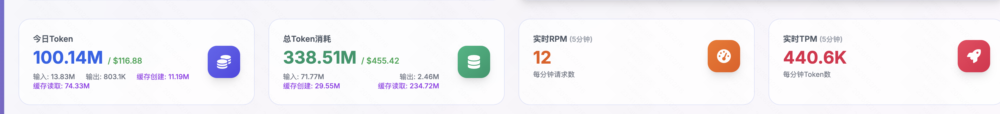

## 一天 1 亿 Token 的背后：传统工程师之死与超级个体之生

春节深夜，屏幕上跳动的数字让我脊背发麻：**1 亿。**

这是我单日烧掉的 AI Token。

换算成人工：如果靠我自己敲代码，这个工作量够我不眠不休干三年。

但那天，我**一行代码都没看。**

那一刻我突然清醒：传统意义上”靠编码谋生”的工程师，正在快速消亡。取而代之的，是一个全新物种——**超级个体。**

## 01. 从百万到 1 亿：三次认知跃迁，彻底改写协作规则

我与 AI 的协作，不是线性升级，而是三次颠覆性的认知重构。

**第一阶段：百万 Token——AI 是“需要不断沟通指导的实习生”**

刚开始用 AI 时，我把它当成一个能直接干活的工具。结果发现：让它写个接口，得先花半小时解释业务背景；它理解偏了，我要重新梳理思路；代码写出来有 Bug，我得逐行调试。打开统计面板：**几百万 Token。**

虽然整体效率还是比自己动手高，但那种“不放心”的感觉始终挥之不去——就像带一个刚入职的实习生，不是他不想做好，而是需要不断沟通、反复校准，才能让产出真正可用。即便他写完了，我也不敢直接上线，总得逐行审查、反复修改，生怕藏着隐形 Bug。

这一阶段，大部分 Token 都消耗在“对齐理解”和“纠错反馈”上。

**第二阶段：千万 Token——AI 是“高效执行者”，但我是“瓶颈”**

跨过某个临界点后，消耗突然涨到**几千万 Token**。

变化的核心不是 AI 变聪明了，而是我终于摸清了“与 AI 对话的语法”：该给多少上下文、如何拆解需求、哪些细节必须明确、哪些可以留白。

AI 的产出质量肉眼可见提升：代码规范、逻辑严谨，不时能给出超出预期的优化方案。我审查的速度越来越快，工作量也减轻了不少。

但瓶颈依然存在——**我的眼睛和时间，就是产能的天花板。** 哪怕 AI 的效率是我的 10 倍，最终的产出上限，依然被我自己的精力锁死。

**第三阶段：1 亿 Token——AI 是”主力军团”，我是”指挥官”**

真正的质变，始于我放弃“审查每一行代码”的执念。

我先做了一件事：**给自己搭了一套能信任 AI 的协作模式。** 流程规范、测试规范、结果验收标准——全定好。

那天，AI 自己完成了任务拆解、编码、自测、提交。我全程没看一行代码，没审一个 PR，只在它拿不准的时候回答了一些疑问。

晚上收工时，Token 统计赫然显示：**1 亿。**

我突然明白：从百万到 1 亿，不是量的积累，而是协作范式的彻底翻转。

传统工程师的“编码能力”，在我身上，已经不再是核心价值。

## 02. 残酷真相：你的护城河正在消融

大多数人还在幻想“用 AI 提高 30% 效率”的温柔场景。

但现实是：

| 时代 | 生产力公式 | 核心角色 |
|------|------------|----------|
| 过去 | 生产力 = 你 × 团队人数 | 生产者（自己干活） |
| 现在（多数人认知） | 生产力 = 你 × AI | 主导者（AI 帮你干活） |
| 未来（已发生） | 生产力 = AI × 你的判断 | 指挥官（你管 AI 干活） |

AI 已经从“辅助工具”变成“主力执行者”，而你，必须从“干活的”变成“管干活的”。

如果你现在的工作，依然是对着 PRD 敲重复代码、修常规 Bug、做机械迭代——**你的价值正在归零。**

AI 写代码比你快 10 倍，出错率比你低，成本只是你的零头。初级工程师每天干的活，AI 已经能独立完成。

年薪百万以上的资深工程师呢？你的优势确实还在，但正在缩小：

- 架构能力？你现在比 AI 强，但它每一次版本更新都在逼近
- 经验积累？你十年的沉淀，AI 正在用几个月追赶
- 全局视野？只要上下文窗口再大一点，AI 就能记住你记不住的细节

今天你还领先，但 AI 的学习速度是以“天”为单位的。留给你的时间窗口，比你想象的短得多。

## 03. 超级个体的崛起：一个人，就是一支军团

“传统工程师之死”的另一面，是“超级个体的诞生”。

以前做一个产品，需要前端、后端、测试、运维协同作战，周期以月为单位，成本以百万计。

现在，**一个资深工程师 + 无限制的 Token，就能抵得上过去一个团队的产出。**

AI 帮你写前端代码、搭后端服务、做自动化测试、监控线上状态——它不需要工资，不需要休息，24 小时待命，能同时推进 N 个任务。

更重要的是：**职责的边界开始模糊。**

你不再需要纠结自己是前端还是后端，是开发还是测试——因为你不再亲自干活了。你只需要判断“这个方案对不对”，AI 会帮你完成所有执行层面的工作。

你不再是“团队中的一颗螺丝钉”，而是“能独立交付的超级个体”：

- 你可以一个人完成从架构设计到部署上线的全流程
- 你可以独立开发 SaaS 工具，面向全球用户收费
- 你可以给企业提供定制化技术方案，赚比打工高 10 倍的收入

未来 3-5 年，软件行业会出现剧烈两极分化：

- 一极：大量“只会写代码”的工程师被淘汰，传统雇佣模式持续萎缩
- 另一极：能驾驭 AI 的超级个体崛起，一个人吃掉过去一个团队的利润

## 04. 重新思考自己的价值：我能帮AI干什么

当 AI 能写完大部分代码，我开始问自己：**我的价值到底在哪？**

反复折腾下来，有五件事，是我现在每天在做、也觉得值得做的：

**第一件事：从写代码，变成定规则**

我不再坐在电脑前一行行敲代码，而是：

- 把模糊的业务需求，拆成 AI 能理解的具体任务
- 定好“什么叫写得好”——代码规范、测试标准、验收条件
- 最后看一眼结果：能用吗？有价值吗？有没有踩到边界？

听起来简单，做起来才发现：能把需求说清楚，本身就是一种稀缺能力。

**第二件事：把“我会写”变成“我懂选”**

代码可以让 AI 写，但选择题得自己做：

- 这个架构为什么要这么搭？换一种行不行？
- 这个方案看起来都对，但哪个更适合三年后的业务？
- 这个需求背后，用户到底想要什么？

这些东西 AI 给不了答案，得自己想。我把这叫**判断力**——可能是工程师最后的护城河。

**第三件事：用 AI，但不盲信 AI**

我用 AI 写代码，但会去看它写了什么；让它出方案，但会琢磨它为什么这么想。

挺费时间的，明明 AI 一秒给出结果，我还要花十分钟回头看。但我发现：**看不懂 AI 代码的人，终将被 AI 替代；能看懂 AI 逻辑的人，才能驾驭 AI。**

这不是清高，是生存策略。

**第四件事：不等“准备好”，先进场**

AI 迭代太快了。今天它写不了的代码，明天可能就会了；今天还需要你手把手教，明天可能自己就拆完了。

等“准备好”的那天，窗口可能已经关了。我现在的心态是：边做边学，边错边改。

**第五件事：每天问自己一遍——没了我，这事还成吗？**

这是个残忍的问题，但很有用。

如果 AI 能独立完成，那我的价值在哪？如果团队没我也能转，那我凭什么待着？

想清楚这个问题，才知道明天该往哪走。

## 05. 最后的话：恐惧与兴奋，都源于“可能性”

看着 1 亿 Token 的统计数字，我既恐惧，又兴奋。

恐惧的是：靠“写代码”就能安身立命的时代，真的结束了。未来几年，会有很多工程师被迫离开熟悉的赛道，面临转型的阵痛。

兴奋的是：一个人能创造的价值，从未如此巨大。以前想都不敢想的项目，现在一个人就能落地；以前需要团队协作才能实现的目标，现在靠 AI 就能完成。

时代的车轮从未停止转动。每一次技术革命，都会淘汰一批旧物种，催生一批新物种。

传统工程师的消亡，不是悲剧，而是进化的必然。超级个体的崛起，不是偶然，而是技术赋能的结果。

你可以抱怨 AI 抢走了你的工作，也可以拥抱 AI，让它成为你最强大的武器。

你可以继续做“被时代抛弃的生产者”，也可以转型为“驾驭时代的指挥官”。

选择就在此刻。

而你的价值，从来不是“会写多少行代码”，而是“能用技术创造多少价值”。